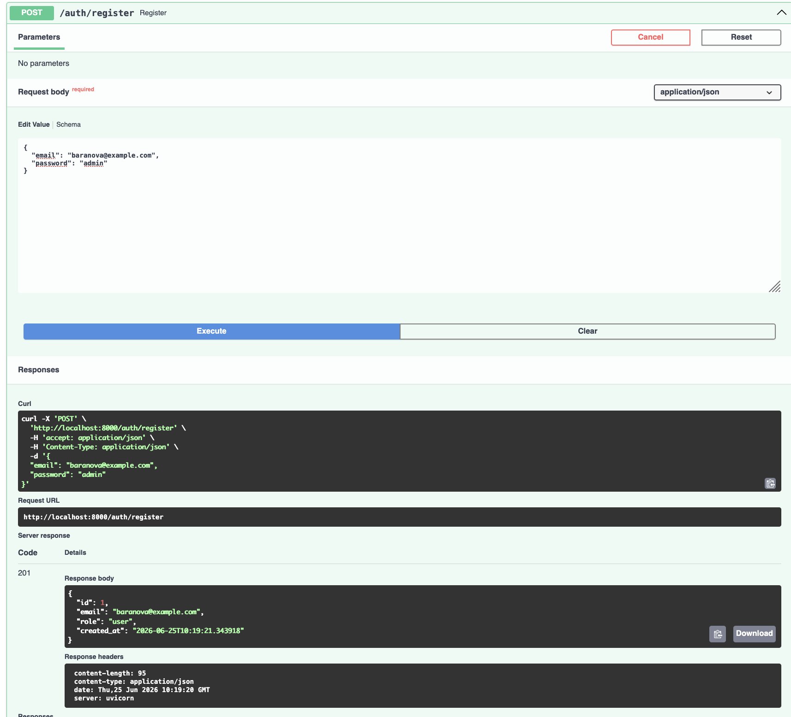
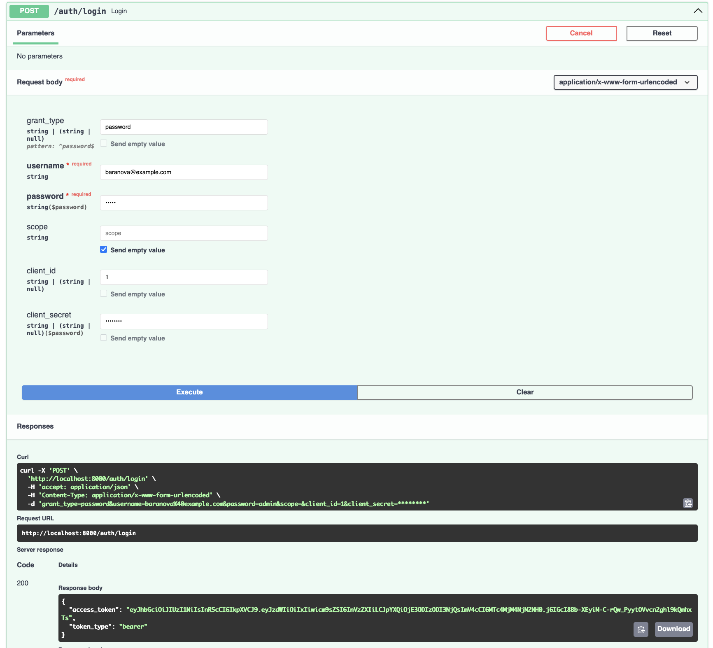
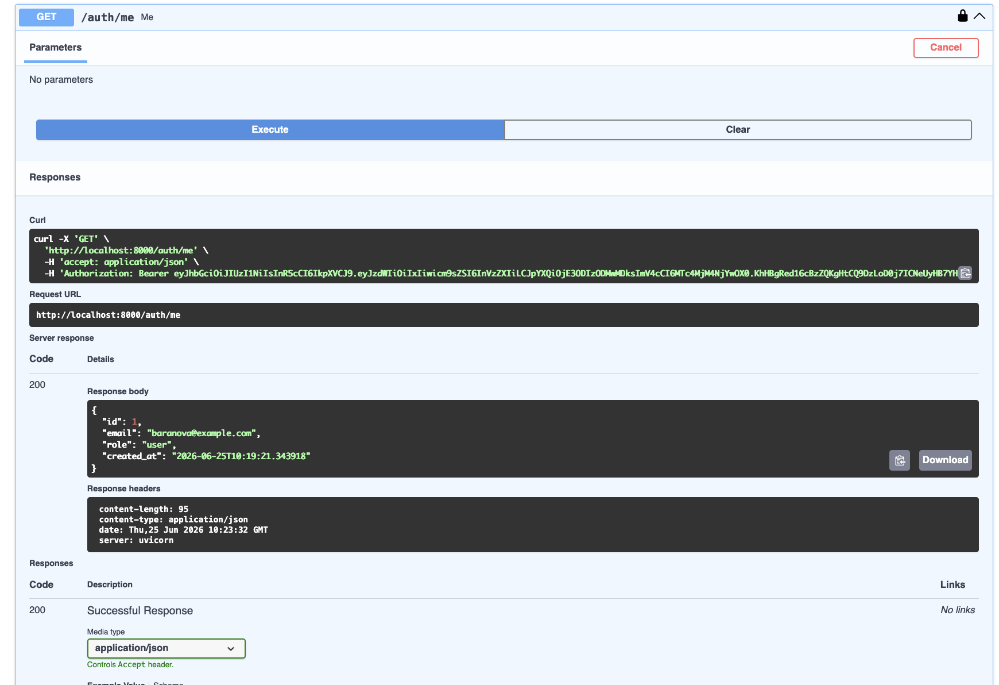
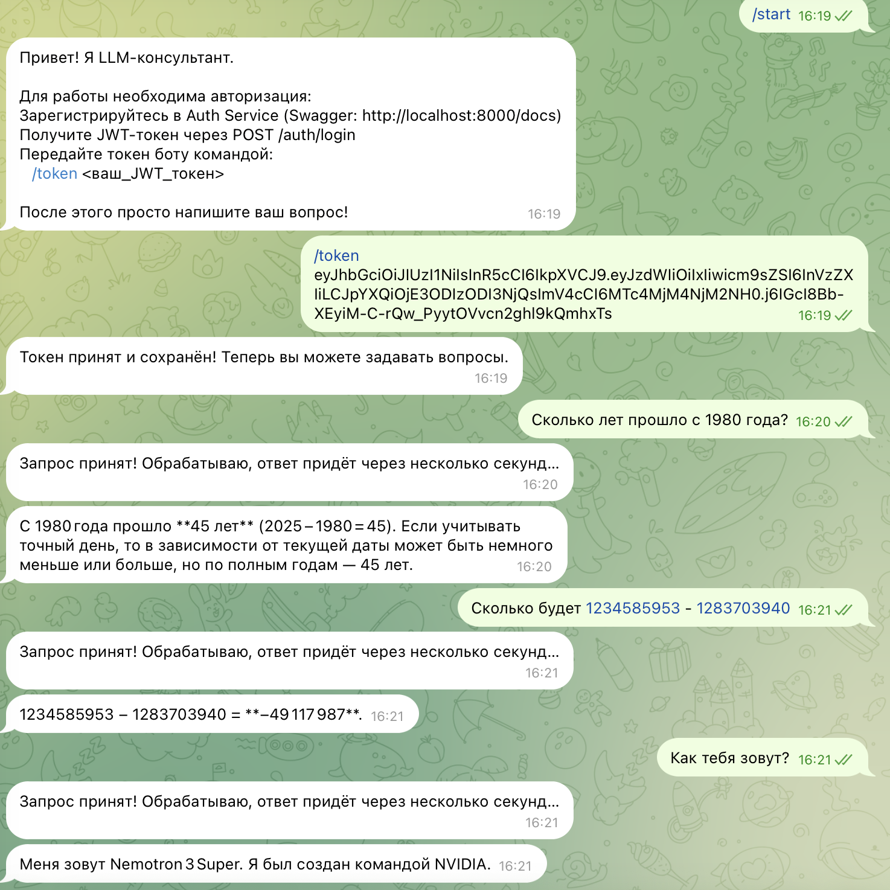
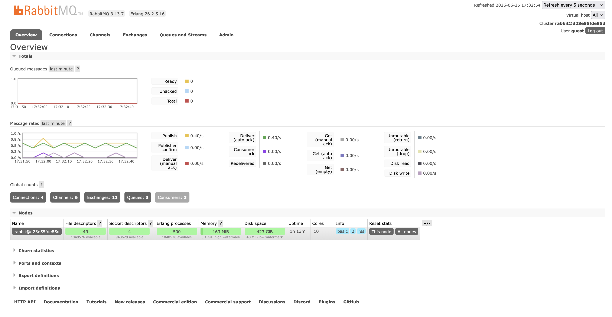
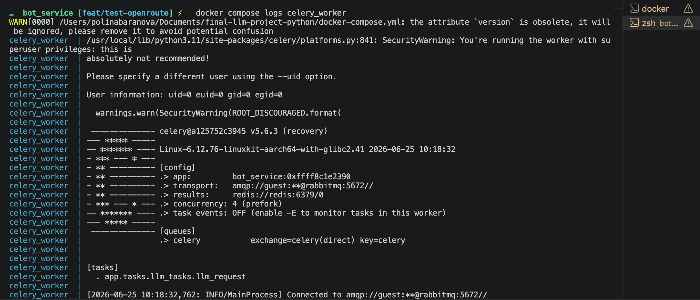
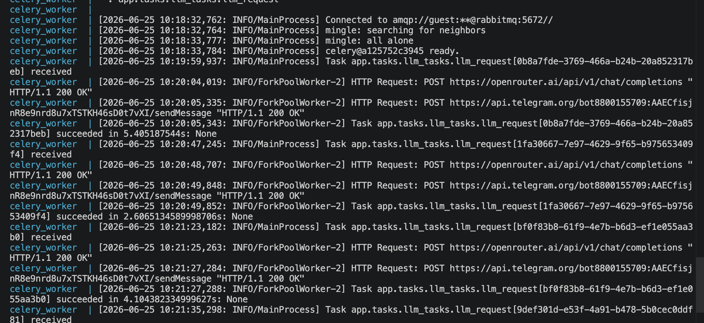

# final-llm-project-python

Двухсервисная система: сервис авторизации и Telegram-бот с асинхронной обработкой запросов к LLM.

## Структура проекта

```
final-llm-project-python/
├── auth_service/
│   └── app/
│       ├── api/          # роуты и зависимости
│       ├── core/         # конфиг, security, исключения
│       ├── db/           # модели, session
│       ├── repositories/ # слой доступа к данным
│       ├── schemas/      # Pydantic-схемы
│       ├── usecases/     # бизнес-логика
│       └── main.py
├── bot_service/
│   └── app/
│       ├── bot/          # диспетчер, хэндлеры
│       ├── core/         # конфиг, JWT валидация
│       ├── infra/        # Celery, Redis
│       ├── services/     # OpenRouter клиент
│       ├── tasks/        # Celery задачи
│       └── main.py
└── docker-compose.yml
```

## Запуск

### Настройка переменных окружения

`bot_service/.env`:
```env
TELEGRAM_BOT_TOKEN=your-bot-token
OPENROUTER_API_KEY=your-openrouter-key
```

### Запуск через Docker

```bash
docker compose up --build
```

## Использование

1. Зарегистрируйтесь через Swagger (`POST /auth/register`) или curl:
```bash
curl -X POST http://localhost:8000/auth/register \
  -H "Content-Type: application/json" \
  -d '{"email": "surname@example.com", "password": "yourpassword"}'
```

2. Получите JWT токен (`POST /auth/login`):
```bash
curl -X POST http://localhost:8000/auth/login \
  -d "username=surname@example.com&password=yourpassword"
```

3. Откройте бота в Telegram, передайте токен:
```
/token <ваш_JWT_токен>
```

4. Задавайте вопросы.

## Эндпоинты

| Метод | URL | Описание |
|---|---|---|
| POST | `/auth/register` | Регистрация пользователя |
| POST | `/auth/login` | Логин, получение JWT |
| GET | `/auth/me` | Профиль текущего пользователя |
| GET | `/health` | Статус bot service |

## Демонстрация работы

### 1. Регистрация пользователя



---

### 2. Логин и получение JWT-токена



---

### 3. Профиль текущего пользователя



---

### 4. Передача токена боту. Запрос и ответ



---

### 5. RabbitMQ



---

### 6. Логи Celery worker




## Тесты

```bash
# auth_service
cd auth_service
pytest tests/ -v

# bot_service
cd bot_service
pytest tests/ -v
```